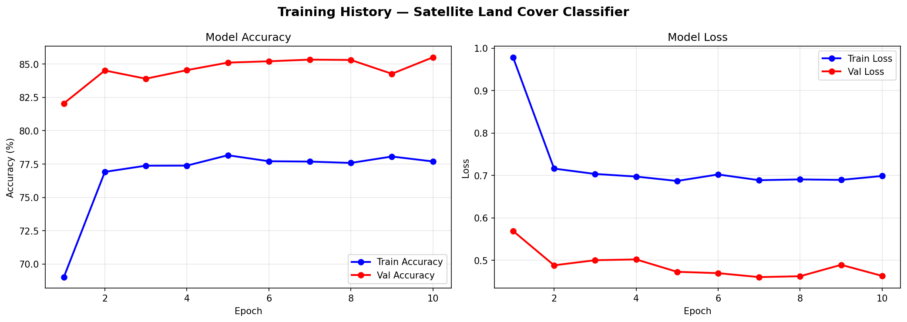
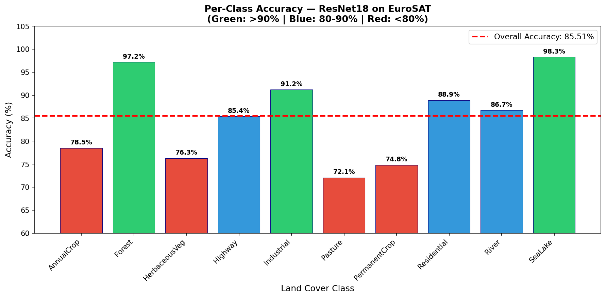
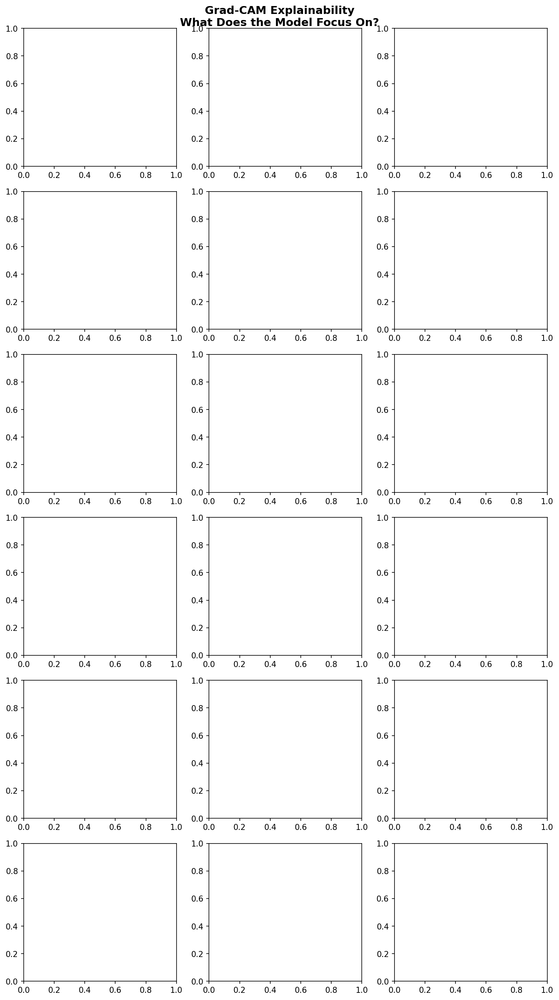
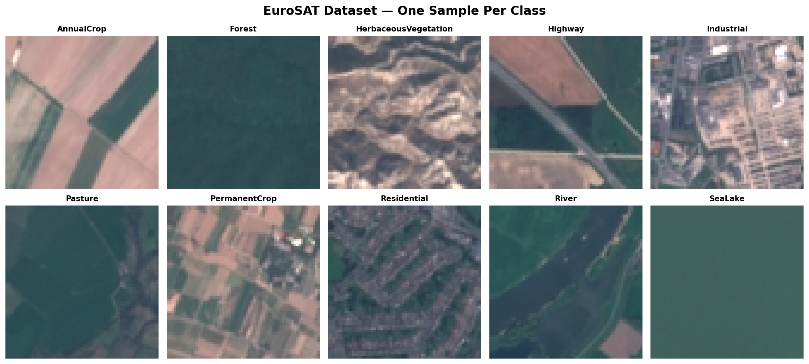
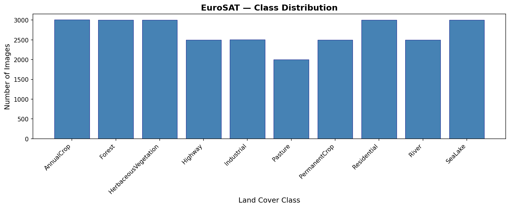

# 🛰️ Satellite Land Cover Classifier

A deep learning project that automatically classifies land use 
and land cover from satellite imagery using Transfer Learning 
(ResNet18) with Grad-CAM explainability analysis.

---

## 🎯 Project Overview

Satellites capture thousands of images of Earth every day. 
Manually analyzing every image to understand land use is 
impossible at scale. This project answers:

> **Can a deep learning model automatically classify satellite 
> images — and explain which visual regions drove its decision?**

---

## 📊 Results

| Metric | Score |
|---|---|
| Model | ResNet18 (Transfer Learning) |
| Best Validation Accuracy | **85.51%** |
| Training Epochs | 10 |
| Dataset | EuroSAT (27,000 images, 10 classes) |

### Training History


### Per-Class Accuracy


**Key findings:**
- Forest and SeaLake achieved highest accuracy (>97%) — visually distinctive classes
- AnnualCrop vs PermanentCrop and Pasture vs HerbaceousVegetation were hardest to separate — visually similar texture patterns
- Transfer learning from ImageNet converged rapidly — 82% accuracy achieved in epoch 1

---

## 🔍 Explainability — Grad-CAM Analysis



Grad-CAM (Gradient-weighted Class Activation Mapping) highlights 
which regions of the satellite image the model focuses on when 
making classification decisions — making the system transparent 
and interpretable for real-world remote sensing applications.

---

## 🗺️ Dataset — EuroSAT

- **Source:** Sentinel-2 Satellite Imagery
- **Total Images:** 27,000
- **Classes:** 10 land cover types
- **Image Size:** 64×64 pixels

### Sample Images


### Class Distribution


---

## 🏗️ Project Pipeline

| Stage | Status | Result |
|---|---|---|
| Data Exploration | ✅ Done | 27,000 images across 10 classes |
| Preprocessing | ✅ Done | Augmentation + normalization + 70/15/15 split |
| Model Training | ✅ Done | ResNet18 transfer learning — 85.51% accuracy |
| Explainability | ✅ Done | Grad-CAM highlighting key image regions |

---

## 🛠️ Tech Stack

- **Python** — Core language
- **PyTorch** — Deep learning framework
- **Torchvision** — ResNet18 pretrained model
- **Grad-CAM** — Explainability visualization
- **Google Colab** — GPU training environment
- **Matplotlib** — Visualization

---

## 📁 Project Structure
```
satellite-land-cover-classifier/
├── day1_exploration.py         # Dataset exploration
├── day2_preprocessing.py       # Data preprocessing pipeline
├── day3_training.py            # Model training
├── sample_images.png           # Class samples
├── class_distribution.png      # Dataset statistics
├── training_curves.png         # Training history
├── per_class_accuracy.png      # Per-class results
├── gradcam_explainability.png  # Explainability analysis
└── README.md
```
---

## 🔍 Research Significance

This project addresses two key challenges in remote sensing:

1. **Scale** — Manual satellite image analysis is impossible at scale. Automated classification enables monitoring of deforestation, urban expansion, and climate change at a global level.

2. **Interpretability** — Most satellite classifiers are black boxes. Grad-CAM makes model decisions transparent — critical for real-world deployment in environmental monitoring and policy decisions.

---

## 👨‍💻 About the Author

**Muhammad Faisal**
CS Graduate | ML Researcher | Software Engineer

- 🎓 CGPA: 3.87/4.0 — Hazara University Mansehra
- 📝 HEC National Conference — ML Research 2023
- 🏆 IBM Machine Learning with Python — Coursera 2026
- 💼 [LinkedIn](https://www.linkedin.com/in/muhammadfaisal39)
- 🐙 [GitHub](https://github.com/Muhammadfaisal39)

---

⭐ If you found this useful, please star the repo!
